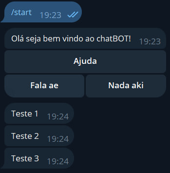

# Telegram API Bot With Spring Boot

## Description

This Telegram bot is a model that will show products for sale and will have automatic payment return. The bot will have buttons to facilitate the purchase process and will be fully automated.

## Usage

1. Create a Telegram bot and get the bot token and username in [@botfather](https://t.me/botfather).
2. Set the environment variables in your ```application.properties``` file.
3. Run the application using the Spring Boot CLI.
4. The application will start and send messages to the chat.

## Environment Variables

* ```${BOT_TOKEN}``` - Bot Token from [@botfather](https://t.me/botfather)
* ```${BOT_USERNAME}``` - Bot Username from [@botfather](https://t.me/botfather)
* ```${ADMIN_ID}``` - Use ```/getid``` command to get your Telegram ID from [@myidbot](https://t.me/myidbot)

## Commands

### Commands for users

* ```/start``` - Start the bot
* ```/id``` - Get your Telegram ID
* ```/suporte``` - Send a message to the admin
* ```/ajuda``` - Command list

### Commands for admin

* ```/ban``` - Ban a user
* ```/unban``` - Unban a user
* ```/banidos``` - List banned users
* ```/ajuda``` - Command list admin

## Author

* Lucas Bonny - [Github](https://github.com/LucasBonny)

## Image example

